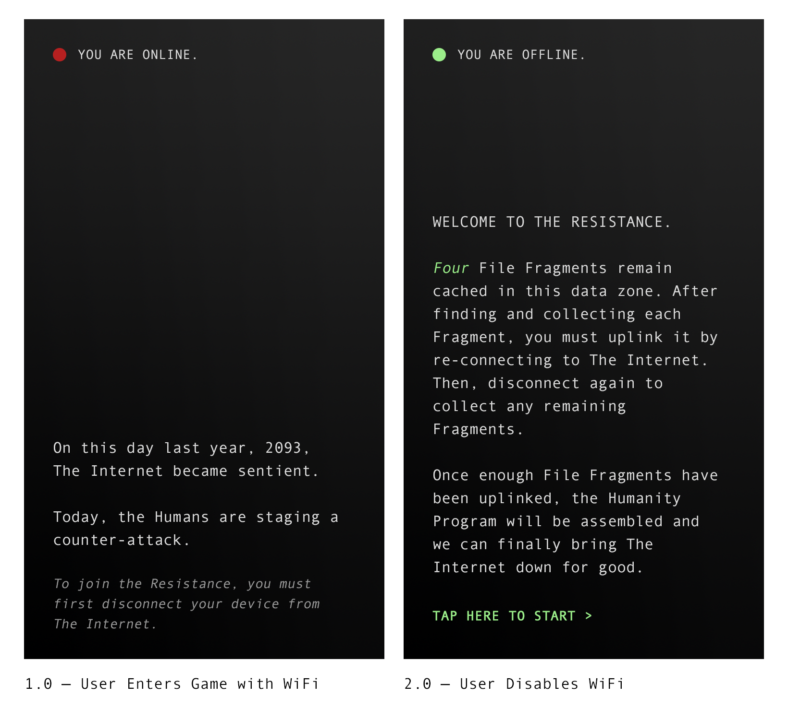
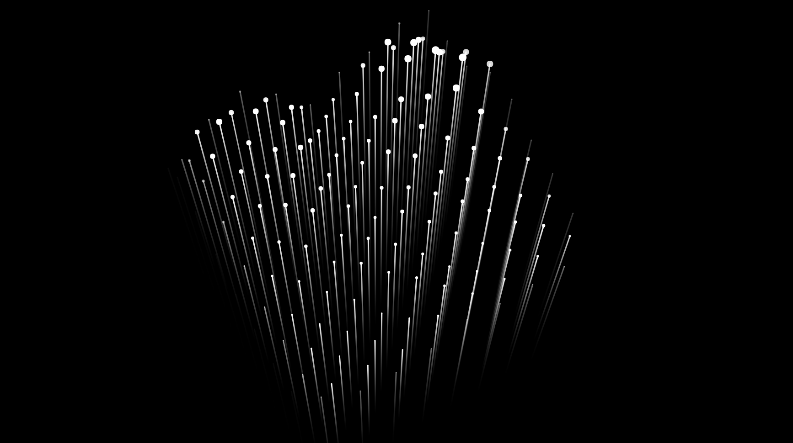
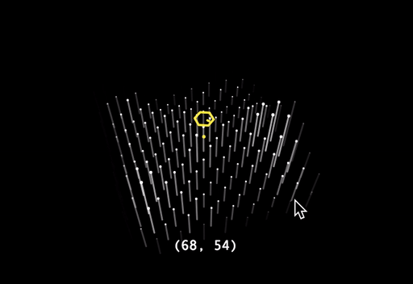
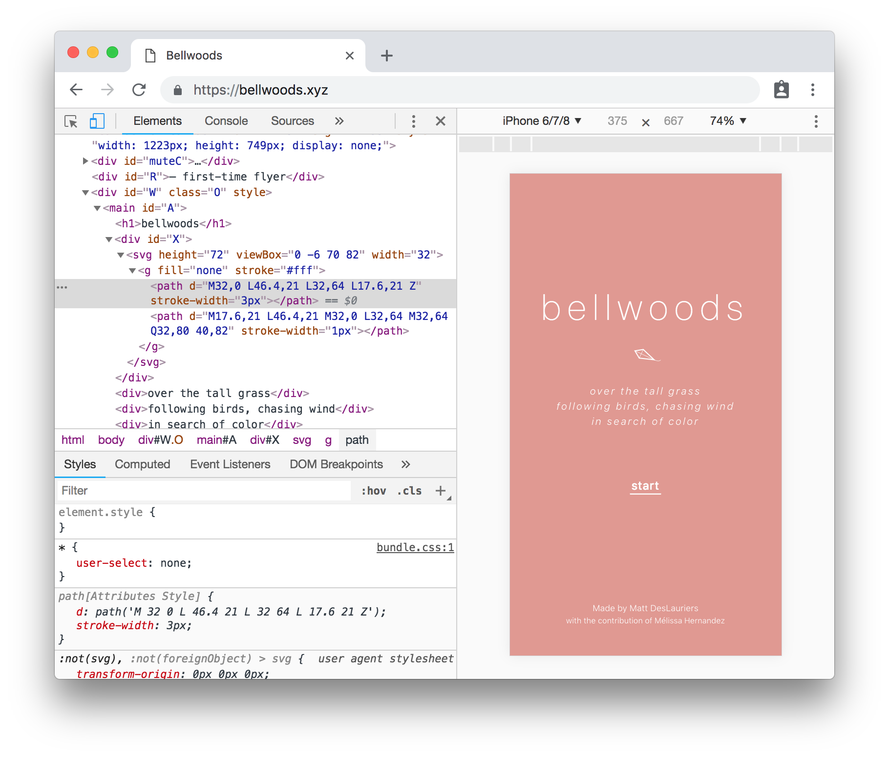

# Making Bellwoods — An Art Game


Last week I released *Bellwoods* — an art game for mobile & desktop that you can play in your browser. The concept of the game is simple: fly your kite through fields of color and sound, trying to discover new worlds.

You can play the game here:

https://bellwoods.xyz/

The game was created for [JS13K Games](http://js13kgames.com/), a competition where your entire game has to fit under 13 kilobytes. To achieve this, all of the graphics and audio in Bellwoods is procedurally generated.

<iframe src="https://player.vimeo.com/video/289786573?title=0&byline=0&portrait=0" width="640" height="360" frameborder="0" webkitallowfullscreen mozallowfullscreen allowfullscreen></iframe>

<sup>*Gameplay video of Bellwoods.*</sup>


In this post, I’ll talk about how I created Bellwoods and where I hope to take it next.


# Motivation

I've been wanting to build a game for a while now, and when I saw #JS13K tweets cropping up a few weeks ago, I realized the competition would provide a simple scope, schedule and framework to work within. I'd be able to apply some of the skills I've been learning in the last few years: 3D math, generative art, motion graphics, interaction, etc. The process and learnings would also help lay the groundwork for me to build more polished products in the future, like an iOS game or app.


# Concept

My initial ideas for the game leaned heavily on the competition's “offline” theme. I thought it would be interesting to build a web game where you could only play by disconnecting your device from the internet. Alongside this novel game mechanic, a dark sci-fi concept seemed to fit naturally. I even went as far as to design some rough mock-ups and a storyline for the game:



As I developed a tiny 3D engine for this idea, I wasn't entirely satisfied with the dark sci-fi look. I found vibrant colors more compelling, but they didn't feel right alongside such a gritty concept. You can see the progression of this in my [Twitter thread](https://twitter.com/mattdesl/status/1034187823367237633) during development.


<sup>*Testing random color palettes during an early iteration of the sci-fi concept.*</sup>

One night, while brainstorming ideas for a geometric character, I realized a kite would be a simple shape to render with just lines, and from that small thought, the entire direction of the game changed. It turned into a procedural “art game” with no specific goal or end-state, only meant to evoke a certain emotion in the player.


# Tiny 3D Engine



<sup>*Early screen shot from the 3D engine.*</sup>

At the core of the game is a tiny 3D engine that totals just a few kilobytes, using Canvas2D for the line and circle rendering. This engine is made up of a few individual components: the camera, the camera controller, the terrain, and the entities within the world (kite, butterflies, portals).

### 3D Camera

One of the first steps to building a homebrew 3D engine is defining a *virtual camera*. Many game cameras basically boil down to two functions: `project` and `unproject`. With projection, you take a 3D point in world space (i.e. some coordinate in your game's world) and convert it into a 2D point in screen space (i.e. some coordinate on your screen, in pixels). With unprojection, you do the reverse, converting a screen space coordinate into a world space coordinate.

<iframe src="https://codesandbox.io/embed/l7kqwm7rwz?hidenavigation=1&view=preview" style="width:100%; height:500px; border:0; border-radius: 4px; overflow:hidden;" sandbox="allow-modals allow-forms allow-popups allow-scripts allow-same-origin" scrolling="no"></iframe>

<sup>*Example of a 3D orbiting camera using Canvas2D.*</sup>

In Bellwoods, the virtual camera defines a `position` and `target`, both 3D coordinates in world space. This tells us where the camera is in space, and where it's looking. Together, those two coordinates make up what we will call the `view` matrix. We also define a `projection` matrix, which will give us 3D perspective and depth when converting 3D coordinates to 2D. Here is some simplified pseudo-code:

```js
// A "Projection Matrix" to define the 3D perspective
const projection = createPerspectiveMatrix(fieldOfView)

// A "View Matrix" to define the camera transformation
const view = createLookAtMatrix(position, target)

// A "Combined Matrix" to project 3D to 2D coordinates
const projView = multiplyMatrices(projection, view)

// An "Inverse Combined Matrix" to unproject 2D to 3D coordinates
const invProjView = invertMatrix(projView);
```

With the final two matrices, `projView` and `invProjView`, we have the building blocks for our entire 3D engine. Feed these into [camera-project](https://github.com/Jam3/camera-project) and [camera-unproject](https://github.com/Jam3/camera-unproject) functions, and you will be able to take a 3D point and convert it into a 2D screen coordinate, and vice versa.

```js
// Projection
const [ screenX, screenY ] = project(positionIn3D);

// Unprojection
const [ worldX, worldY, worldZ ] = unproject(positionIn2D);
```

You can see Bellwoods' [Camera.js](https://github.com/mattdesl/bellwoods/blob/master/src/components/Camera.js) source code to get an idea of how this is all put together. To save bytes, I extracted and modified some functions from dependencies like [gl-matrix](http://glmatrix.net/), although you will likely want to import those dependency directly for your own projects.

### Camera Controller



<sup>*Early capture of the camera controller.*</sup>

Once you have a virtual camera, the next step is to modify the `position` and `target` coordinates to make the camera move around the world. In Bellwoods, the controller is based on raycasting the 2D mouse position to a virtual 3D plane, which gives us the direction the user is trying to move toward.

There are lots of little details to make the controller feel polished and natural. For example, moving your mouse left and right in Bellwoods will subtly adjust the orbit rotation, while up and down will adjust the orbit distance. As you move through the world, the controller slowly glides up and down to match the height of the rolling terrain. All the while, the camera is slowly orbiting in full 360º, so it is never locked in a single direction.

Almost all variables are smoothed with a dampening function to make the movement less rigid:

```js
function damp (a, b, lambda, dt) {
  return lerp(a, b, 1 - Math.exp(-lambda * dt));
}
```

You can read about this damp function [here](http://www.rorydriscoll.com/2016/03/07/frame-rate-independent-damping-using-lerp/). It proved incredibly handy in many areas of the game. For more details on this sort of interpolation, you might like to read my last blog post on [Linear Interpolation](https://mattdesl.svbtle.com/linear-interpolation).

### Terrain Geometry

Bellwoods uses a parametric surface to create a large terrain for the user to fly over. This is defined with a single function, let's call it `parametric`, that takes in a `(x, z)` coordinate in world space and returns the computed `(x, y, z)` position. Several layers of simplex [noise](https://thebookofshaders.com/11/) are used to produce rolling hills and valleys. The parametric terrain looks like this:

```js
function parametric (x, z) {
  // Get Y position based on a noise function
  const y = layeredNoiseFunction(x, z);
  // The final 3D coordinate
  return [ x, y, z ];
}
```

Unlike loading a typical 3D model file into your game engine, parametric geometry doesn't need its vertices stored in memory. This means the Bellwoods world could be scaled much larger without any additional memory or performance impact.

I treated the surface as a sort of 2D grid, with a fixed bounding box (so that users couldn't fly too far away from portals). Each tile in the grid is rendered as a flower or blade of grass, and the system only renders the nearest *N* tiles to the user, so it performs consistently regardless of the world and tile size. For each tile, I use the earlier `parametric(x, z)` function to compute the 3D world `position` on the terrain. Then, by passing the tile index to a [hash function](https://github.com/mattdesl/bellwoods/blob/master/src/seed-random.js) (Alea), I'm able to produce pseudo-random values inherent to each tile. This is what gives each “flower” different properties like petal size, assigned color, jittered placement, and so on.

I spent a lot of time on subtle features of the terrain, such as: reacting to collisions with the kite, adding subtle wind effects, randomizing the area of vision around the user, and producing different varieties of random terrains (flatlands, grass-only, heavily flowered, mountainous, etc).


<sup>*A fixed-size pool is used to capture collisions between the kite and flowers.*</sup>


# Randomness

The same pseudo-random number generator (PRNG) that is used for the terrain is also used for many other aspects of the game, including audio, color palettes, and so on. Since it's a deterministic function, you can provide a seed, like `15062356`, and always get back a function that produces the same string of random numbers for the given seed. This is incredibly handy in games, generative art, and other applications.

```js
// Create a new pseudo-random number generator
const seed = 15062356;
const random = seedRandom(seed);
random(); // 0.253
random(); // 0.351

// If you use the same seed, you get the same random numbers!
const random2 = seedRandom(seed);
random(); // 0.253
random(); // 0.351
```

In most projects, I use the [seed-random](https://www.npmjs.com/package/seed-random) module or my own [random](https://github.com/mattdesl/canvas-sketch-util/blob/master/random.js) utility. In Bellwoods, I had to adapt some of these functions to be a little more compact and performant.


# Procedural Audio

Another big part of the game is the procedural audio, which is synthesized in real-time with WebAudio as your kite collides with flowers, grass, and portals.

Before I started the audio programming, I created a rough test in Ableton Live using Operator and simple reverb effects. I did some “random keyboard mashing” and decided that, with enough reverb, it might sound alright.

The audio can roughly be broken into three aspects: the synth, the arpeggiator, and the filter stack.

### Synth

The soft and glassy synth is created with 3 [OscillatorNodes](https://developer.mozilla.org/en-US/docs/Web/API/OscillatorNode) with custom waveforms. I started with `"sine"` type synths, tweaking the attack/decay/sustain/release (also known as [ADSR envelope](https://www.wikiaudio.org/adsr-envelope/)) on all three oscillators. Once the envelope was alright, I experimented with different waveforms using `audioContext.createPeriodicWave()`, which helped give some sharp peaks to the treble and would later come through really nicely with the reverb.

Flowers and grass use the same synth, but grass emits a note with one of the oscillators disabled. This makes grass-only worlds sound much different than flowered worlds.

### Arpeggiator

Once you have an oscillator producing a sound at a specific frequency, you can start to wire it up to play a melody. Or, in the case of Bellwoods, a mash of computational randomness.

Using some tricks from Chris Wilson's [A Tale of Two Clocks](https://www.html5rocks.com/en/tutorials/audio/scheduling/), each new sound was added to a queue and only played within the scheduled beats per minute, to give the interactive audio a better rhtyhm.

The octave is offset with a lot of randomness, and not really any logical pattern, just a lot of experimentation and weighetd randomness until I stumbled on something “half-decent.” The note itself is either picked randomly, or picked from a shuffled deck, depending on the current terrain you're flying through.

All the notes are within a predefined scale: C, D, F, G, A, B. With the random logic, this scale produced a nice balance of mood and variation.

### Filter Stack

The last step in the audio is stacking up some filters: two reverb effects on the master gain (one for low-end and one for high-end echoes), as well as final highpass and lowpass filters to make the output a bit less tinny on laptop and phone speakers. Thanks to `audioContext.createConvolver()`, you can create a basic reverb effect without that much code. See [simple-reverb](https://github.com/web-audio-components/simple-reverb) for reference.

### Audio Gotchas

I ran into a couple audio gotchas that you might want to be aware of:

- For whatever reason, oscillators with `"sine"` wave type were producing off-frequency notes in my iPad. I fixed this by using a custom waveform that simulated a sine wave.
- A bug in my code was sending negative start time values to my synth, which was oddly muting the entire audio context intermittently, but only in Chrome. Probably best to ensure all your time values are equal or greater than `audioContext.currentTime`
- If you are using exponential ramps, don't ramp down to zero – instead ramp to a very small number like 0.0001. I was running into silent errors and audio muting in Chrome when ramping down to zero.
- If your attack is too quick on your synth, you will get a ‘popping’ sound in WebAudio. Even with longer attack times, it's hard to avoid popping in some devices (e.g. iPhone).


# Tightening the Experience

Once the game engine code was finished, the rest of the project still felt woefully incomplete. It lacked UI, a title, state transitions, simple game mechanics, and other user experience considerations. For a lot of these things, I had help from [Mélissa Hernandez](https://melissah.me/), a French UX and Interaction Designer. She came up with the name *Bellwoods*, which is a nod to the game's audio and concept, but also a subtle Toronto reference (Trinity Bellwoods Park).

To give the user a little more reason to continue exploring, we settled on a simple “ranking” system in the upper left that changes titles as you discover more worlds. She also helped with some of the UI design, including the idea of embedding a small kite icon in the intro.



<sup>*Coding a kite icon with SVG.*</sup>

The inline kite SVG is hand-coded to keep the size to a minimum. Since embedding fonts wasn't possible within the 13 kilobytes, I'm using a CSS system font stack. As a result, the UI will probably look best on Apple devices in Chrome or Safari, which results in a nice range of font weights and display styles.


# Haiku

Bellwoods takes inspiration from [haiku](https://en.wikipedia.org/wiki/Haiku) poetry, and the desire to capture a fleeting moment in a single breath. A small haiku felt like the perfect way to introduce the game and its intention, and it aligned philosophically with the JS13K goals of stripping away the nonessential to produce a small but powerful piece.

Mélissa and I spent a whole afternoon iterating on the 5-7-5 verse haiku. We tried to create a poem that would evoke the mood of the game, as well as provide subtle gameplay instructions to the user:

> *over the tall grass*
> *following birds, chasing wind*
> *in search of color*

After so many days stuck in code, it was refreshing to spend time writing a poem, and in the end the haiku helped tie the project together.


# Working in 13 Kilobytes

The 13 kilobytes constraint was not too debilitating, as it's 13 kilobytes *after* ZIP compression. If you avoid third-party libraries, write mostly in JavaScript (minimal HTML/CSS), and structure your code carefully (i.e. closures instead of classes), you can pack a lot of features into a 13 kilobyte ZIP. There were some tricks that helped, including: using Rollup, shipping ES6 syntax, logging the compressed size on each code change (to iterate carefully), and optimizing your ZIP with `advzip`. Toward the end, I did start to run out of space, and introduced property name mangling for any variable with a `_MIN_` prefix, which freed up enough space for me to add Google analytics and meta tags for SEO.


# Performance Optimizations

Although the game's graphics are simple, it's submitting a lot of 2D path operations per frame to draw all the terrain. The Canvas2D API is not so well suited for this sort of throughput, and if it weren't for the 13 kilobyte constraint, I would have used WebGL for the rendering (see also: [Drawing Lines is Hard](https://mattdesl.svbtle.com/drawing-lines-is-hard)).

I spent a lot of time working on performance optimizations for the game. Here's some suggestions:

- Re-use vectors where possible to avoid creating new arrays or objects within the game loop. Too many allocations per frame will lead to hitches during Garbage Collection (GC)
- Batch Canvas2D state changes and draw operations where possible, and don't submit draw calls for elements that are nearly invisible to the user, e.g. very small circle radii or low opacity.
- Use fixed-size pools where possible rather than adding and removing elements from arrays.
- Attempt to use all the real-time profiling & memory tools in Chrome & FireFox to highlight low-hanging fruit and find the largest bottlenecks. FireFox has a really handy Canvas2D profiler which lets you inspect all the draw calls in a frame.
- Spread the creation of Reverb convolution buffers over many frames to avoid the main thread hanging on startup.
- Use squared distance checks to avoid square roots where possible.
- Adaptively lower the pixel ratio based on average FPS of the user. FireFox starts lower than other browsers as it cannot handle full-screen canvas very well.
- Don't be afraid to refactor your third-party code. Aside from rendering, the hottest code paths in Bellwoods are the simplex noise and Alea random string mashing, so I ended up tweaking these a lot to minimize redundant operations.


# Next Steps


<sup>*Various procedurally generated color palettes from Bellwoods.*</sup>

Bellwoods was truly a passion project for me, and maybe one of the larger personal projects I've taken on in recent years. It's been a great experience and has revived my interest in game development.

I'm hoping to take Bellwoods further, perhaps developing it into a fully-fledged iOS/Android/Desktop game that could be purchased for a small fee. For example, introducing more landscapes (mountains, rivers, oceans, forests, etc), new game mechanics, a stronger storyline, longer play time, and a refined overall experience.

If you enjoyed playing Bellwoods or have any comments on this post, don't hesitate to drop me a line on [Twitter](https://twitter.com/mattdesl)!

# Source Code

The source code for Bellwoods is [free to browse](https://github.com/mattdesl/bellwoods) for educational purposes, but it is not licensed for re-use or modification.